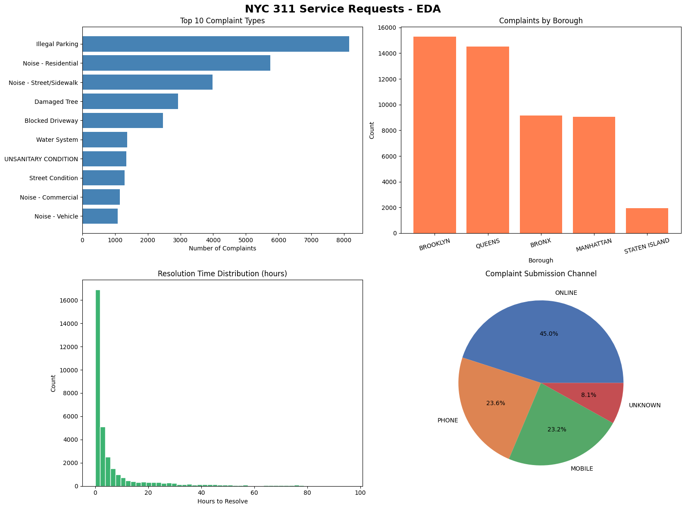

# What New Yorkers Complain About: A 311 Data Analysis

Exploratory data analysis of 50,000 real NYC 311 service requests pulled 
directly from NYC Open Data API.

## Tools Used
- Python, Pandas, NumPy
- Matplotlib, Seaborn
- Google Colab

## What I Did
- Loaded 50,000 records via live API call
- Dropped 9 columns with >90% missing data
- Converted date fields from strings to datetime
- Engineered a `resolution_hours` feature
- Identified and flagged negative resolution time anomalies
- Produced 4 visualizations and a structured findings report

## Key Findings
- 🚗 Illegal Parking is the #1 complaint — nearly double the next category
- 🗺️ Brooklyn & Queens account for ~60% of all complaints
- 👮 NYPD handles 50% of all service requests
- ⏱️ Median resolution time is under 2 hours
- 💻 45% of complaints are submitted online

## Visualizations

